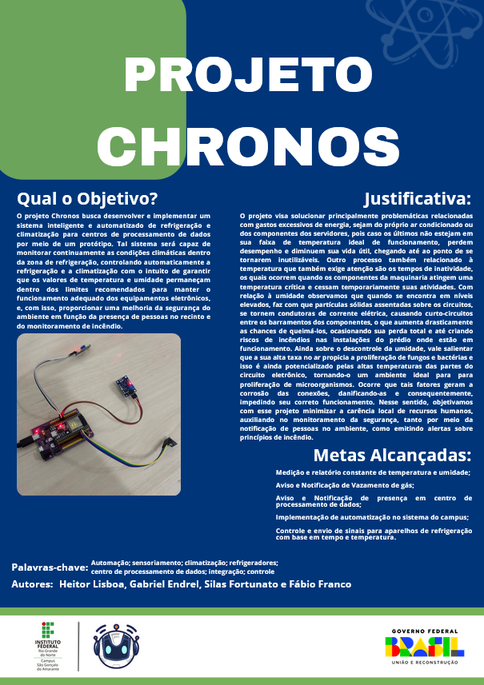

# Meus-projetos

Olá, meu nome é Heitor. Sou estudante de Técnico em Informática pelo IFRN, desenvolvedor em formação e busco uma oportunidade como estagiário ou jovem aprendiz na área de TI.

Alguns projetos desenvolvidos no IFRN, como o Chronos, não podem ter parte de seu código disponibilizado publicamente por envolverem uso institucional. Ainda assim, estou disponível para apresentar detalhes técnicos, arquitetura e decisões de desenvolvimento.

## Tecnologias
- Java, C++, JavaScript
- HTML, CSS
- MySQL
- Arduino / ESP32 / ESP8266

## Projetos

### Projeto Chronos (Apresentação)

**Sistema de monitoramento e automação para data center**  
Desenvolvi, junto com a equipe, um protótipo com ESP32 e Home Assistant para monitoramento de temperatura, umidade e automação de refrigeração.

**Principais tecnologias:** ESP32, sensores ambientais e automação IoT.

---

### Projeto Robotizando no IF

Desenvolvimento de materiais didáticos e projetos voltados ao ensino de robótica com Arduino (robôs seguidor de linha, semáforos automatizados e sistemas com sensores de luz) para alunos do 9º ano de escolas do município de São Gonçalo do Amarante.

Exemplo de material:
[foto do slide](assets/aula.pgn) [Slide da primeira aula](assets/SLIDES_AULA_01.pdf)

---

### Outros projetos

- [Biblioteca Digital](https://github.com/Heitor-Lisboa/Biblioteca-digital) – Sistema em Java com POO  
- [HEXTEK](https://github.com/Heitor-Lisboa/HEXTEK) – Player de música web  

---

## Contato
- E-mail: hlisboa89@gmail.com  
- Telefone: (84) 99474-3179  
